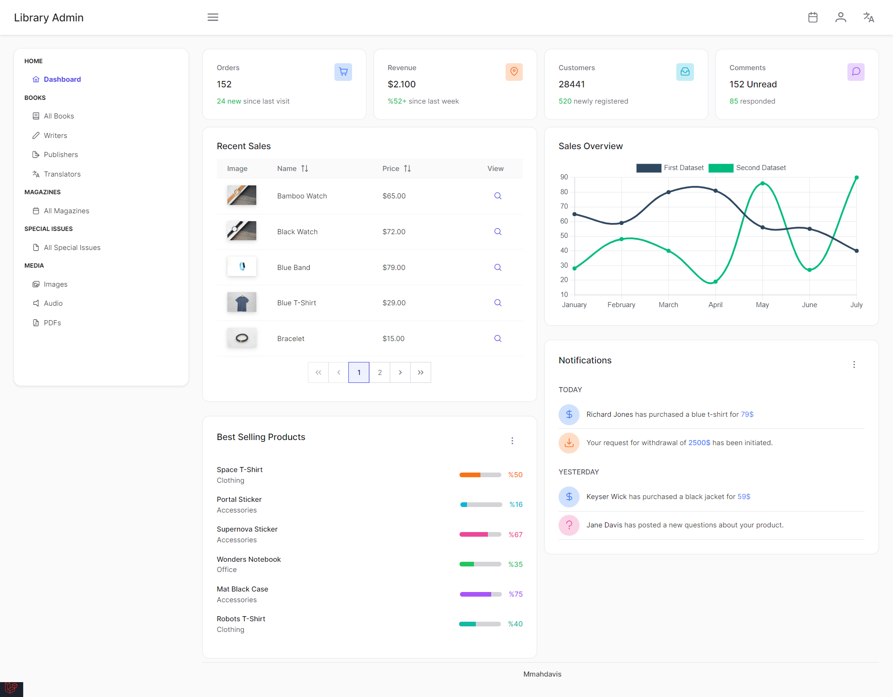

# CMS Library

## Pages


## Requirment

PHP,
Composer,
Nodejs,
Npm,

## How To Install 

```
01. git clone https://github.com/mmahdavis/Library2.git
02. cd Library2
03. composer install
04. npm install
05. create database in your phpmyadmin
06. set .env values
07. php artisan migrate:fresh --seed
08. npm run dev
09. php artisan serve
10. open http://localhost:8000/
```
